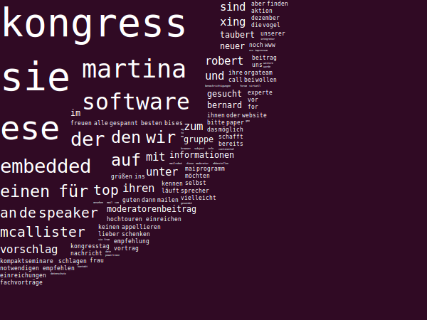

# wordcloud
A wordcloud generator for GTK 2+

## How to Use
Run WordCloud.exe and drag & drop a text, file or folder you want to search.

- Mousebutton 2<pre>Generate</pre>
- Enter<pre>Activate Whitelist</pre>
- Shift + Enter<pre>Activate Blacklist</pre>

Optionally, the following files can be used for initialization.

+ settings
+ blacklist
+ whitelist and
+ input

## Compiling
The application is compiled with

* MonoDevelop 2.8.6.3

## Licensing
[MIT](https://github.com/bernardtaubert/wordcloud/blob/master/LICENSE)

